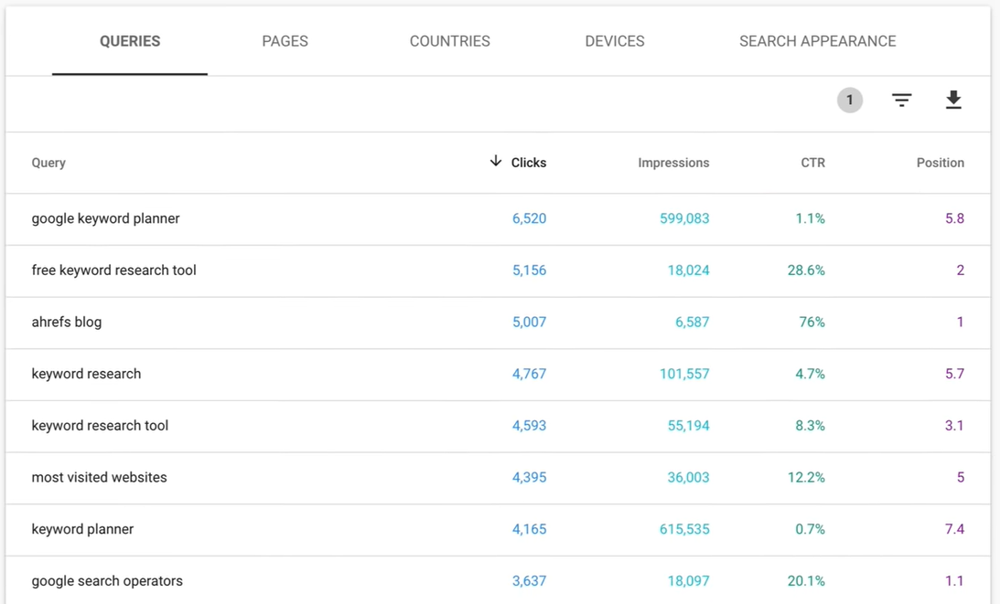
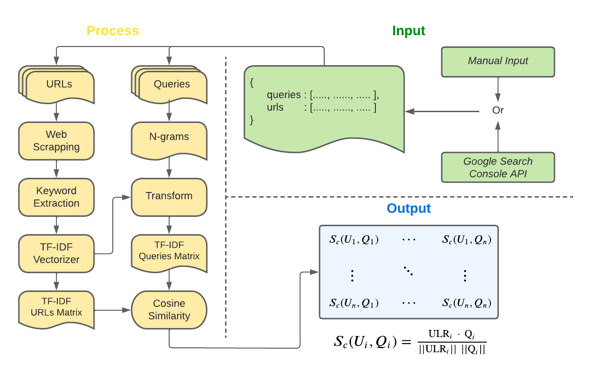
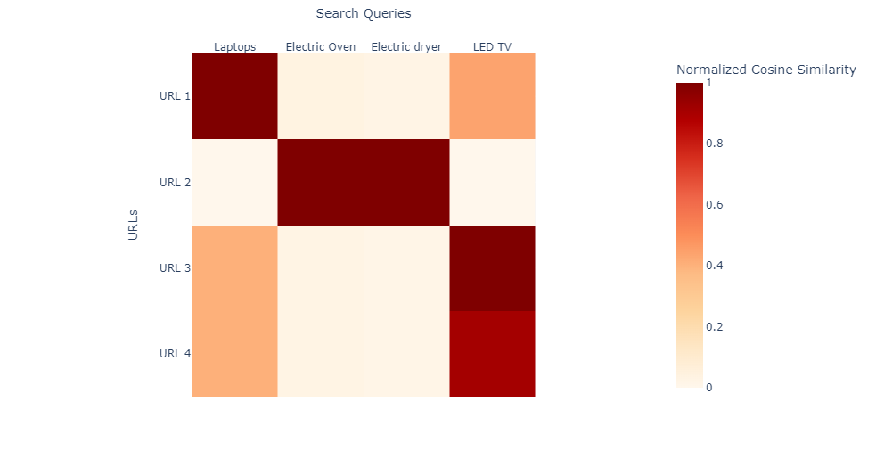

[](https://colab.research.google.com/drive/1dH_el2xLT0wlnqAmJMBubPRd_LggRua8?usp=sharing)
# E-commerce Keyword Cannibalization Detection
Keyword cannibalization detector is a machine learning package that quantifies the possibility of reduced search engine optimization (SEO) due to multiple pages having similar main keywords. The implementation is based on the basic data provided by Google Console Search which is available for any website discovered by Google. 

<br>


## Background
Organic search is responsible for 41% of the traffic received to retail and e-commerce websites while paid listings account for only 23.6%. However, being discovered or ranking high in Search engine results pages (SERPs) requires a set of qualities that any search engine optimizes. Such qualities can be user-based (e.g., location or demographic information) and content-based (e.g., website content and presented data). The resulting SEO delivers the website's click-through rates (CTR) which consequently corresponds to more product visibility and sales. 

<br>

The issue is that many e-commerce websites have multiple pages that share plenty of similarities in terms of the presented content though the content can be for different products. A simple search query can lead to multiple pages of the website appearing on SERPs. Though an outcome might seem desirable, it is detrimental in diminishing the authority of the landing page and reducing CTRs. 

<br>

The image below shows a data sample obtained from Google Console which is a platform for webmasters to analyze traffic to their websites, relevant search queries, and ranking on Google SERPs. However, the analysis is limited in terms of what pages are competing against each other and most importantly what keywords are responsible for cannibalization.  



<br>

## Methodology
The objective of detecting keyword cannibalization is achieved by accurately extracting representative keywords from the website and measuring the similarity of such keywords to search queries. The resulting output is a similarity matrix of multiple URLs against search queries. Website pages that score a high similarity to a certain search query are considered competing pages in terms of only keywords. The methodology is described in the following steps:

- **Input Method**

    The input is a dictionary of two lists: string search queries and URLs. This can be provided manually by the user or retrieved by providing Google Search Console API credentials.  

- **Web Scrapping**

    Web scrapping is accomplished by BeautifulSoup package. Scrapping is limited to textual content including titles, headers, and paragraphs. Other types of data such as image captions or visual descriptions are ignored.  


- **Keyword Extraction**

    The representative keywords are extracted by processing the text and generating frequency dictionaries. Given that many organic traffics are accomplished by short search queries, lexical similarity in this context is more important than semantic similarity. Hence, the keyword extraction process utilizes a frequency dictionary of stemmed tokens rather than contextual text embeddings. 

- **N-Grams**

    To further improve the frequency dictionary of tokens, bi and tri-grams are added to the list of extracted keywords. 


- **TF-IDF Vectorizer**

    Term Frequency - Inverse Document Frequency (TF-IDF) is fitted using the corpora of texts obtained from the scraped URLs. The fitted vectorizer is then used to transform the processed queries. 

- **Similarity Matrix**

    The final output of the Keyword Cannibalization Detector is a similarity matrix. Firstly, the output of the TF-IDF vectorizer is two matrices: a matrix of vectorized URLs' keywords and a matrix of vectorized queries' keywords. The cosine similarity between every URL and query vector generates the similarity matrix which can be normalized and visualized as a heatmap as shown in the analysis example below.   




<br>


## Usage
1. Clone the repository 

    ```console
    clone https://github.com/robaie98/keyword-cannibalization-detector.git
    ```
2. Move `cannibalizer_detector` folder to your project directory

3. Import the class and specify the input data method.

    ```python 
    from cannibalizer_detector.detector import Detector

    detector = Detector()

    # Manual Data Input
    manual_json = {
        'queries': [
            'HP Laptop 2020',
            'Smart phones 2023',
        ],
        'links':[
            'https://www.extra.com/en-sa/computer/laptops/c/3-303',
            'https://www.extra.com/en-sa/hp/c/HP'
        ]
    }  

    # Data retrieved automatically from a verified Google Console API
    ## The site must be verified to be the property of the user
    ## via Google Console API 
    console_json = {
         'api_name':'detector',
         'api_version':'v2',
         'client_secrets_path':'creds_file/creds.json', 
         'site':'https://www.extra.com'  # 
     }

  
    ```
4. Call the method `load` with manual data insertion or by providing Google Search Console Credentials

    ```python
    # Either load the detector with
    detector.load(manual_json = manual_json)
    # or with
    detector.load(console_json = console_json)
    ```
5. Run the Analysis by calling `analyze`. 
    ```python
    detector.analyze()
    ```
6. Output the similarity matrix or visualize it as a heatmap
    ```python
    # Access the similarity matrix 
    detector.similarity_matrix 

    # or visualize the matrix
    detector.visualize_matrix
    ```

## Analysis Example

The following analysis is performed on Extra's website and by the manual insertion method. Refer to Google Colab Notebook [](https://colab.research.google.com/drive/1dH_el2xLT0wlnqAmJMBubPRd_LggRua8?usp=sharing). 

- URL 1         https://www.extra.com/en-sa/computer/laptops/clamshell/lenovo-ideapad-3-core-i5-8gb-256gb-ssd-14-inch-arctic-grey/p/100330466
- URL 2         https://www.extra.com/en-sa/white-goods/dryers/c/4-404/facet/brandEn:GENERAL%20ELECTRIC
- URL 3         https://www.extra.com/en-sa/electronics/television/led/tcl-65-inch-uhd-google-led-tv/p/100321682
- URL 4         https://www.extra.com/en-sa/electronics/television/led/samsung-65-inch-4k-smart-tv/p/100261160




It can be seen that URLs 1 and 2 have less competition as they represent different categories. However, URLs 3 and 4, have a high similarity for the same keyword which indicates that in terms of keywords, such webpages have a chance of cannibalizing each other. 

## Requirements
    beautifulsoup4==4.12.2
    google_api_python_client==2.85.0
    httplib2==0.22.0
    nltk==3.6.5
    numpy==1.20.3
    oauth2client==4.1.3
    pandas==1.3.4
    plotly==5.7.0
    scikit_learn==1.2.2
    urllib3==1.26.7


## References
1. Rakt, M. van de. (2023, March 15). What is keyword cannibalization? Yoast. Retrieved March 8, 2023, from https://yoast.com/keyword-cannibalization/ 

2. Sterling, G. (2021, August 27). Organic search is responsible for 53% of all site traffic, paid 15%. Search Engine Land. Retrieved April 11, 2023, from https://searchengineland.com/organic-search-responsible-for-53-of-all-site-traffic-paid-15-study-322298

